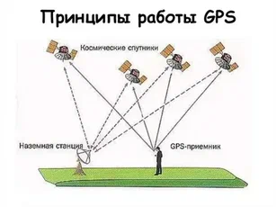

### [Mikal Hart](https://github.com/mikalhart)

#### [TinyGPS](https://github.com/mikalhart/TinyGPS)

#### [TinyGPSPlus](https://github.com/mikalhart/TinyGPSPlus?tab=readme-ov-file)

#### [Руководство по библиотеке TinyGPS++](https://arduinosciencefun.wordpress.com/2020/01/28/a-guide-to-the-tinygps-library/)

#### [Три прикладных примера по TinyGPSPlus](https://best-of-web.builder.io/library/mikalhart/TinyGPSPlus)

***1. Анализ данных GPS:
***
```
#include <TinyGPSPlus.h>

TinyGPSPlus gps;

void setup() {
  Serial.begin(9600);
}

void loop() {
  while (Serial.available() > 0) {
    if (gps.encode(Serial.read())) {
      if (gps.location.isValid()) {
        Serial.print("Latitude: ");
        Serial.println(gps.location.lat(), 6);
        Serial.print("Longitude: ");
        Serial.println(gps.location.lng(), 6);
      }
    }
  }
}
```

***2. Доступ к атрибутам GPS:
***
```
#include <TinyGPSPlus.h>

TinyGPSPlus gps;

void setup() {
  Serial.begin(9600);
}

void loop() {
  while (Serial.available() > 0) {
    if (gps.encode(Serial.read())) {
      Serial.print("Date: ");
      Serial.print(gps.date.value());
      Serial.print(" Time: ");
      Serial.print(gps.time.value());
      Serial.print(" Satellites: ");
      Serial.println(gps.satellites.value());
    }
  }
}
```
***3. Обработка ошибок GPS:
***
```
#include <TinyGPSPlus.h>

TinyGPSPlus gps;

void setup() {
  Serial.begin(9600);
}

void loop() {
  while (Serial.available() > 0) {
    if (gps.encode(Serial.read())) {
      if (gps.location.isValid()) {
        Serial.print("Latitude: ");
        Serial.println(gps.location.lat(), 6);
        Serial.print("Longitude: ");
        Serial.println(gps.location.lng(), 6);
      } else {
        Serial.println("Location data is not valid.");
      }
    }
  }
}
```

#### [Описание протокола NMEA 0183](https://wiki.iarduino.ru/page/NMEA-0183/)

#### [Описание NMEA протокола](NMEA.pdf)

#### [GPS - NMEA sentence information](http://aprs.gids.nl/nmea/)

#### [Как рассчитать точность определения GPS координат](https://s5.hpc.name/thread/o611/131790/kak-rasschitat-tochnost-opredeleniya-gps-koordinat.html)

***HDOP (Horizontal Dilution of Precision)*** не является точностью в метрах. Это оценочная величина, которая показывает, насколько точными являются горизонтальные координаты (широта и долгота). 

Чтобы понять, с какой точностью вычислены координаты, можно использовать приближённые данные:

Для HDOP < 1,0 — точность местоположения может быть около 1–2 метров.
Для HDOP от 1 до 2 — точность может быть около 3–5 метров.
Для HDOP от 2 до 5 — точность может составлять от 5 до 10 метров.
Для HDOP > 5,0 — точность может превышать 10 метров.

> Если точность GPS-устройства в оптимальных условиях составляет 5 м, то при значении hdop, равном 1.2, оценка точности в данный момент составляет 6 м. 
> 
> [То есть вы хотите сказать, что мне нужно предположить](https://gis.stackexchange.com/questions/111004/translating-hdop-pdop-and-vdop-to-metric-accuracy-from-given-nmea-strings), что максимальная точность моего GPS составляет 5 метров, а затем умножить значение hdop на 5, чтобы получить текущую точность определения местоположения... хорошо, спасибо :) 

#### [Оценка точности GPS-измерений с помощью вычисления CEn](https://gis-lab.info/qa/cep.html)

Отметки спутников в системе GPS (Global Positioning System) — это сигналы, которые передают спутники на Землю. Каждый спутник передаёт информацию о своём положении в космическом пространстве и точном времени. 



Сигнал каждого спутника содержит: 

- Псевдослучайный код — для идентификации конкретного спутника.
- Эфемериды — координаты спутника в околоземном пространстве.
- Альманах — сведения о том, где находятся спутники и в каком состоянии.

#### Принцип работы

GPS-приёмник получает сигналы от нескольких спутников одновременно. Приёмник анализирует время, необходимое для передачи сигнала от спутника до приёмника, и использует эту информацию для определения расстояния между приёмником и каждым спутником. 

Зная точные координаты каждого спутника и расстояния до них, приёмник, используя математические алгоритмы, вычисляет свои собственные координаты. 

Основа работы — точная синхронизация всех спутников и приёмников: каждый спутник имеет встроенные атомные часы, которые постоянно корректируются для сохранения точности времени, а приёмник GPS также имеет свой собственный атомный час, который синхронизируется с сигналами от спутников. 

#### Точность

Для определения местоположения GPS-приёмника необходимо наличие как минимум четырёх видимых спутников. Чем больше спутников «видит» приёмник, тем точнее он определяет свои координаты. 

Четвёртый спутник нужен для определения высоты (третьей координаты) и компенсации погрешностей в измерении времени. Остальные спутники помогают уточнить позицию и служат для подстраховки — если один уйдёт из зоны видимости, приёмник пересчитывает местоположение по оставшимся. 

#### Ошибки

Точность определения местоположения зависит от точности измерения расстояний до спутников, которая может быть нарушена различными факторами, такими как атмосферные помехи, многолучевость сигнала и т. д.. 

Для компенсации ошибок используется, например:

- Метод двухчастотных измерений — в двухчастотных приёмниках линейные комбинации двухчастотных измерений не содержат ионосферных погрешностей.
- Расчёт математической модели тропосферных задержек — необходимые для этого коэффициенты содержатся в навигационном сообщении.


