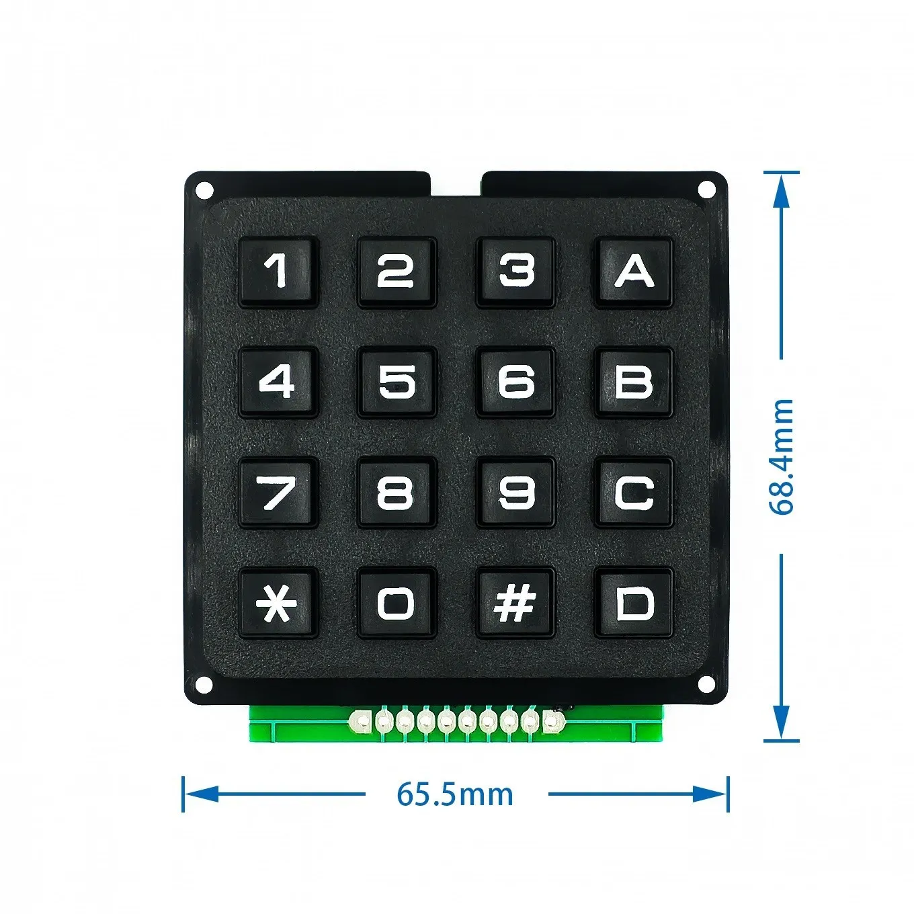

## [Матричный переключатель WC Matrix Array 4x4](https://aliexpress.ru/item/4000873237364.html?spm=a2g2w.orderdetail.0.0.49b14aa6Z9b30p&sku_id=10000010054665644&_ga=2.30515455.1729635843.1761805914-257156806.1703682747)

30-10-2025:

- полагаю, что крайние контакты, это плюс и минус и ими можно не пользоваться, так как кнопки соединяют пины ардуино;

- первые четыре провода слева-направо строки, вторые четыре провода столбцы.

### [Статья: Arduino для начинающих. Урок 10. Подключение матричной клавиатуры и интересные схемы](https://edurobots.org/2017/03/arduino-keypad/)

Матричная клавиатура - дисплей

<video src="matrichnaya-klaviatura-displej.mp4" type="video/mp4" controls poster="matrichnaya-klaviatura-displej.jpg">
</video>

<video src="matrichnaya-klaviatura-kodovyj-zamok.mp4" type="video/mp4" controls poster="matrichnaya-klaviatura-kodovyj-zamok.jpg">
</video>

### [Ардуино: подключение матричной клавиатуры](https://robotclass.ru/tutorials/matrix_keyboard/)

