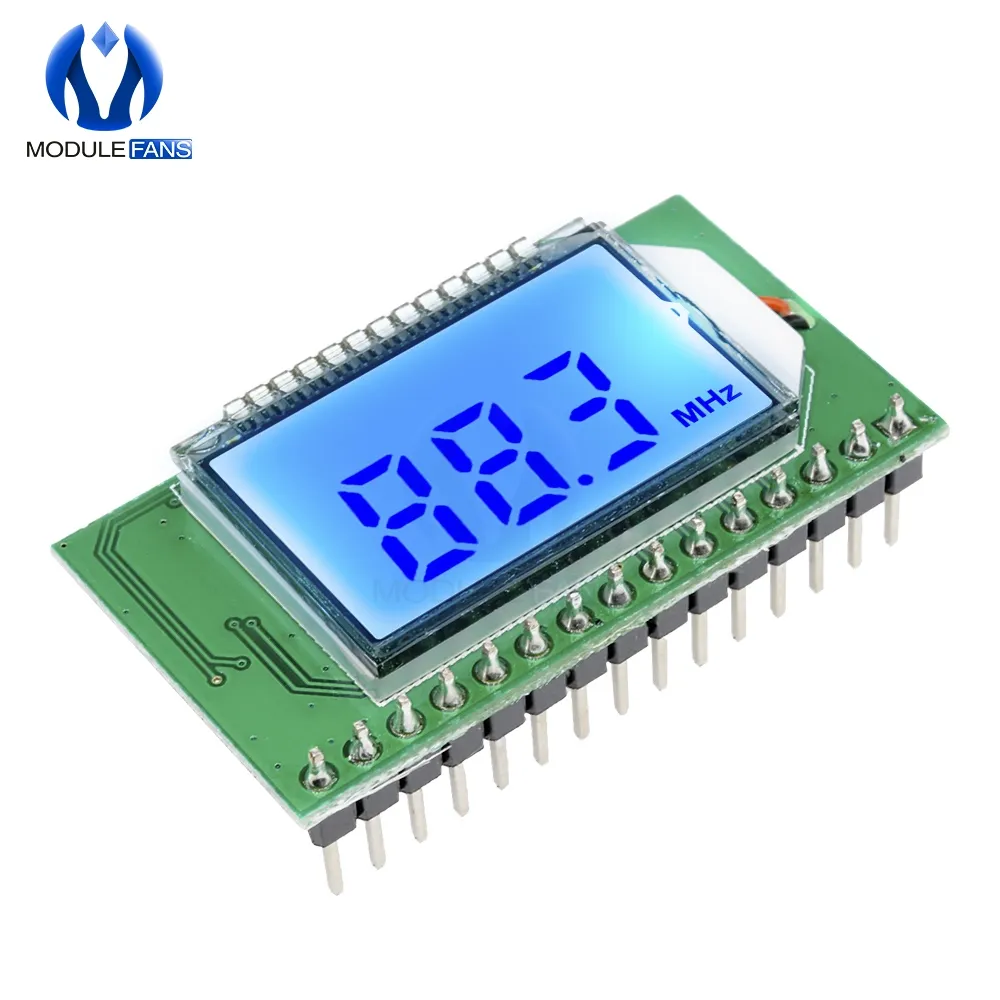
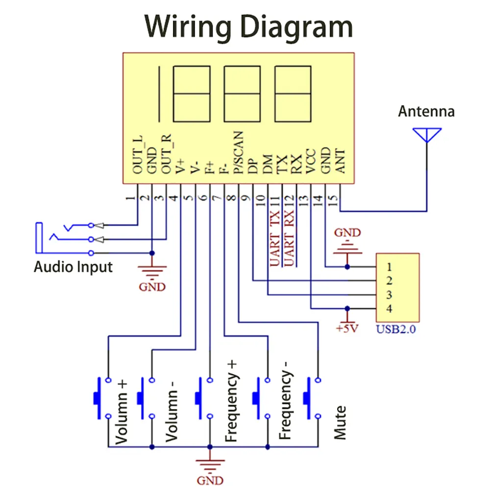
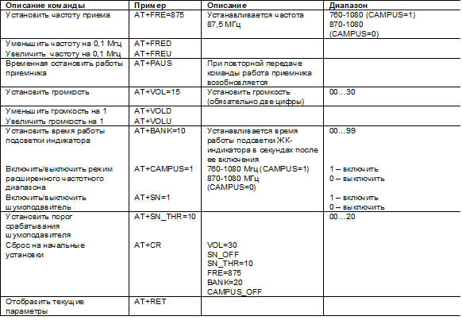

### [Модуль FM радиоприемника DSP PLL 87-108 МГц](https://dzen.ru/a/ZDef2RUfcHalN5CO)

!!! FM-радио за 383 рубля   радио на модуле LCD FM RX v2.0

[Не работает](https://softboard.ru/topic/73395-простая-самодельная-звукотехника/)



```
1: Использование передовой технологии цифровой обработки аудиосигнала (DSP)
   и FM-модуляции с фазовой автоподстройкой (PLL) для придания звуку 
   большей реалистичности, более стабильных характеристик, длительного 
   времени работы без смещения частоты.
   
2: ЖК-дисплей более интуитивно понятен и точен, с очень низким
   энергопотреблением  и минимальными шумовыми помехами.
   
3: Благодаря автоматическому поиску радиостанции и функциям сохранения
   радиостанций, receiver module прост в управлении и использовании.
    
4: Встроенная цифровая регулировка громкости на 30 градусов позволяет 
   легко выполнять основные операции.
   
5: Автоматическое запоминание данных об отключении питания перед 
   сбоем питания.
   
6: Поддержка последовательных команд AT.

7: Стабилизация частоты кварцевого кристалла - изменение температуры больше 
   не приводит к смещению частоты.
   
8: Автоматический поиск в полном диапазоне и сохранение диапазона сигнала 
   в памяти.
 
 
Параметры продукта:
 
Выходная мощность:           500 МВт (проводные наушники)
Диапазон частот:             50 Гц-18 кГц
Канал:                       стерео
Диапазон регулировки частоты приема:
                             закрытое кампусное радио 87,0 МГц-108,0 МГц, 
                             открытое кампусное радио 76,0 МГц-108,0 МГц
Эквивалентный уровень шума:  ≥30 дБ
Напряжение питания:          3,0 В-5,0 В
Ток:                         40 мА
```


#### [Модуль FM радиоприемника DSP PLL 87-108 МГц](https://dzen.ru/a/ZDef2RUfcHalN5CO)

На порт ANT подключаем антенну. Можно провод 20 см, в городе ловит все радиостанции. К G и +5V питание. Лучше подключить 3.3 вольта. Пишут, что при 5 вольтах происходит выгорание чипа. К последним портам R G L – колонку. Порт RX подключаем к порту Arduino TX. Соответственно порт TX -> RX, перекрещиваем соединение.

```
#include <SoftwareSerial.h>      // подключили библиотеку
SoftwareSerial mySerial(2, 3);   // создали объект подключения

// Посылаем команды
mySerial.println("AT+PAUS");     // "поставить на паузу"
mySerial.println("AT+FRE=1035"); // "включить Европа Плюс на частоте 103.5МГц"
```
#### Список команд




#### [Как сделать FM-антенну](https://www.wikihow.com/Make-an-FM-Antenna)

#### [Самодельная антенна из металлопласта для диапазона FM (87,5 – 108 МГц)](https://dzen.ru/a/Y6xhiTcsUwHCUG8d)

#### [Популярная рамочная антенна из фольги](https://samodelino.ru/antenny-svoimi-rukami/antenna-dlya-radio-fm.html)

