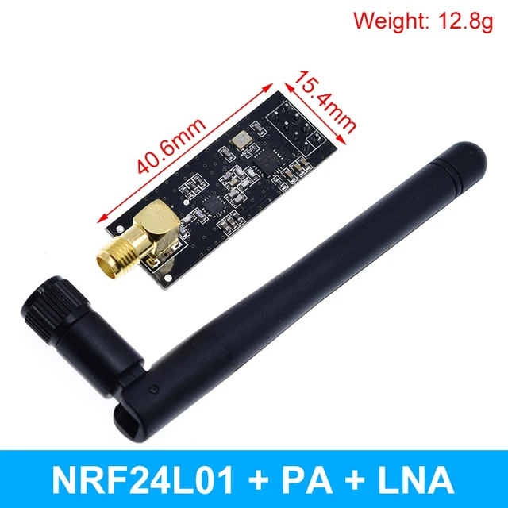
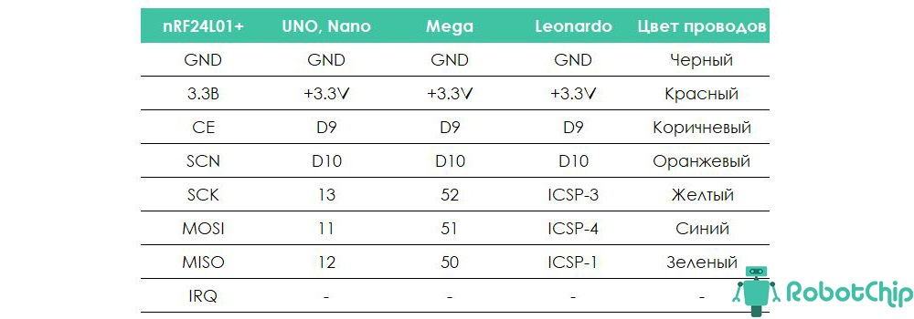
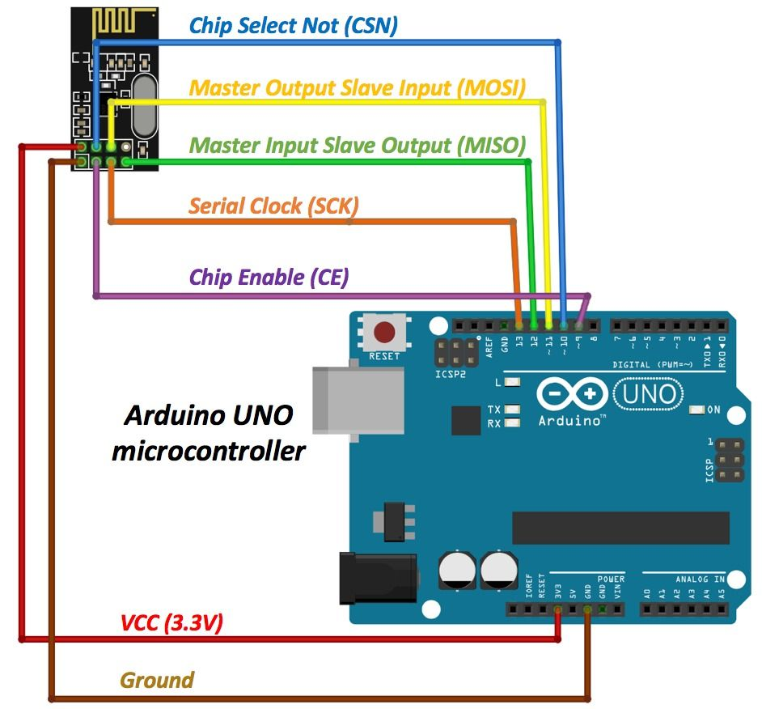

## [Радиомодуль nRF24L01](https://aliexpress.ru/item/1005002975667834.html?spm=a2g2w.orderdetail.0.0.2fa54aa6kHlY5R&sku_id=12000037977979698)



### Комплектация

#### Модуль беспроводной передачи данных TZT NRF24L01 + 2,4 ГГц + PA + LNA 1000 метров

#### Конденсатор!

### Библиография

---

#### Электроника, Arduino и IT

#### [Подключение NRF24L01+PA+LNA к Arduino. Побеждаем радиомодули](https://dzen.ru/a/YYIaUt9Bz32SgEZy)





> #### [Скетч проверки работоспособности модуля и правильности подключения](proverka-rabotosposobnosti-nrf24l01/proverka-rabotosposobnosti-nrf24l01.ino)
> 

Вывод после теста ***NRF24L01 (09.04.2024)***
```
SPI Speedz	= 10 Mhz
STATUS		= 0x0e RX_DR=0 TX_DS=0 MAX_RT=0 RX_P_NO=7 TX_FULL=0
RX_ADDR_P0-1	= 0x000000000e 0xc2c2c2c2c2
RX_ADDR_P2-5	= 0x0e 0xc4 0x0e 0xc6
TX_ADDR		= 0x000000000e
RX_PW_P0-6	= 0x20 0x0e 0x20 0x0e 0x20 0x0e
EN_AA		= 0x00
EN_RXADDR	= 0x0e
RF_CH		= 0x4c
RF_SETUP	= 0x0e
CONFIG		= 0x0e
DYNPD/FEATURE	= 0x0e 0x00
Data Rate	= 2 MBPS
Model		= nRF24L01+
CRC Length	= 16 bits
PA Power	= PA_MAX
ARC		= 14

00000000000000001111111111111111222222222222222233333333333333334444444444444444555555555555555566666666666666667777777777777777

0123456789abcdef0123456789abcdef0123456789abcdef0123456789abcdef0123456789abcdef0123456789abcdef0123456789abcdef0123456789abcdef

01235532101123432110123454441012200000000000000000000000000000000000000000000000010000000000000000000000000000000000000000000000

21245653210012345432111335452311000000000000000000000000000000000000000000000010000100000000000000000000000000000000000000000000

32224656543212355665432123456322100000000000000000000000000000000000000000000000100000000000000000000000000000000000000000000000

33120123454321012344532103254531000000000000000000000000000000000000000000000200010000000000000000000000000000000000000000000000

46432113345543322345654321322444200000000000000000000000000000000000000000000200010100000000000000000000000000000000000000000000

54453412136574433111235322322244320101100101000000011100012010010000000100000200200000000000000000000000000000000000000000000000
```

Вывод после теста ***NRF24L01+PA+LNA (09.04.2024)***
(пока не прикрутил антенну, во второй части теста были нули)

```
SPI Speedz	= 10 Mhz
STATUS		= 0x0e RX_DR=0 TX_DS=0 MAX_RT=0 RX_P_NO=7 TX_FULL=0
RX_ADDR_P0-1	= 0xe7e7e7e7e7 0xc2c2c2c2c2
RX_ADDR_P2-5	= 0xc3 0xc4 0xc5 0xc6
TX_ADDR		= 0xe7e7e7e7e7
RX_PW_P0-6	= 0x20 0x20 0x20 0x20 0x20 0x20
EN_AA		= 0x00
EN_RXADDR	= 0x02
RF_CH		= 0x4c
RF_SETUP	= 0x07
CONFIG		= 0x0f
DYNPD/FEATURE	= 0x00 0x00
Data Rate	= 1 MBPS
Model		= nRF24L01+
CRC Length	= 16 bits
PA Power	= PA_MAX
ARC		= 0
00000000000000001111111111111111222222222222222233333333333333334444444444444444555555555555555566666666666666667777777777777777

0123456789abcdef0123456789abcdef0123456789abcdef0123456789abcdef0123456789abcdef0123456789abcdef0123456789abcdef0123456789abcdef

01221012344332112344432101123443210122343210000345432000000000000000000000000000000000000000000000000000000000000000000000000000

02653212235554542101333421324565320012234543000223443100000000000000000000000001001000000000000000000000000000000000000000000000

02455322123355432000123332101123430210123444000123445400000000000000000000000000001000000000000000000000000000000000000000000000

10445432100233554210122343221012440544221223000212344200000000000000000000000000210000000000000000000000000000000000000000000000

12244564433243456543223446754323420544310223000321011200000000000000000000000000001000000000000000000000000000000000000000000000
```
---

#### Cadil_TM 24 фев 2021 в 23:23

#### [Победа над nRF24L01: на три шага ближе](https://habr.com/ru/articles/476716/)

Модули nRF24L01 работают в полудуплексном режиме. Это как разговор по рации: каждый из корреспондентов в один момент времени либо говорит, либо слушает. То есть, каждый из двух узлов работает в режиме и приемника и передатчика: передатчик, отправив сообщение ждет на подтверждение приема сообщения со стороны приемника.

Я же разделил эту задачу на несколько простых задачек. Вначале модули проверяются на работоспособность и правильность подключения (шаг 1), затем один из пары работающих радиомодулей тестируется на работу в режиме передатчика без ожидания отклика с приемника (шаг 2) и последний этап — улучшение качества связи в этой связке передатчик-приемник (шаг 3).

#### [Шаг 1 - скетч сканера эфира](Cadil_TM-24-фев-2021-в-23_23/skaner-ehfira/skaner-ehfira.ino)

#### [Шаг 2 - скетч передатчика](Cadil_TM-24-фев-2021-в-23_23/sketch-peredatchika/sketch-peredatchika.ino)

#### [Шаг 3 - скетч приёмника](Cadil_TM-24-фев-2021-в-23_23/sketch-prijomnika/sketch-prijomnika.ino)

---

#### [Радио модуль 1100м. 2.4G NRF24L01+PA+LNA](https://iarduino.ru/shop/Expansion-payments/radio-modul-rf-2400-wireless-module-2-4g-1000m.html)

#### [Радиомодуль NRF24L01+подключение к Ардуино](https://arduino-site.ru/radiomodul-nrf24l01/)

#### [Радио модуль nRF24L01 Ардуино подключение](https://роботехника18.рф/nrf24l01-ардуино/)

#### [Обзор радио модуля NRF24L01+PA+LNA](https://robotchip.ru/obzor-radio-nrf24l01palna/)

#### [Range Extender на NRF24L01+PA+LNA: обмен текстовыми сообщениями между устройствами там, где нет сотовой связи](https://habr.com/ru/companies/ruvds/articles/792922/)


!!!

#### [Подключение и настройка nRF24L01 к Arduino (модуль беспроводной связи)](https://www.youtube.com/watch?v=ACVtKDJVXS4)

882 641 просмотр  24 нояб. 2016 г.  Алгоритмы, железки и библиотеки
В этом выпуске познакомимся с модулем беспроводной связи nRF24L01 для Ардуино, научимся его подключать, настраивать и решиим некоторые проблемы. Данный модуль позволяет передавать данные с Ардуино на Ардуино на расстояние до 2 километров, таким образом можно например делать штуки с дистанционным управлением на Arduino, всякие сигнализации, дистанционные кнопки, аппаратуру радиоуправления, и многое многое другое. Эти модули беспроводной связи для Arduino очень дёшвы, а спектр их применения - безгранично широк.

▼ Внимание! Я переехал на github, так что самые свежие версии показанного в видео лежат тут 
https://github.com/AlexGyver/nRF24L01

► nRF24L01 без антенны https://ali.ski/qPkSX
► nRF24L01 с антенной https://ali.ski/1pK53M
► Адаптер питания https://ali.ski/suYpp

▼ Огромный стартовый набор GyverKIT ▼
https://kit.alexgyver.ru/
▼ Уроки Arduino на сайте ▼
https://alexgyver.ru/lessons/
▼ Модули и датчики с Али ▼
http://alexgyver.ru/arduino_shop/
▼ Страница "Заметок Ардуинщика" ▼
http://alexgyver.ru/arduino_lessons/

Теги: #arduino #уроки #ардуино #alexgyver
●●●●●●●●●●●●●●●●●●●●
► Основной канал:   

 / alexgyvershow  
► Поддержать автора https://alexgyver.ru/support_alex/
► Официальный сайт: https://alexgyver.ru/ 
► Почта: alex@alexgyver.ru


!!!

#### [nRF24L01 и Ардуино: побеждаем модуль](https://www.youtube.com/watch?v=n-fLucdM3AE)

63 082 просмотра  10 сент. 2017 г.  Ардуино - это просто!
Радиоуправление, передача даннных и информации - все это легко можно организовать при помощи радиомодулей nRF24L01. Теперь Ардуино может управлять и обмениваться данными с другими устройствами! Но и здесь есть "подводые камни". Производители часто минимализируют качество до такой степени, что модули могут просто не запускаться на обычных настройках. В этом видео посмотрим принципы подключения и настройки модулей для качественной работы.

Скетч Тестера, Приемника и Передатчика: https://drive.google.com/open?id=0Bw5...

Форум по модулям NRF24L01+: http://forum.amperka.ru/threads/nrf24...

Еще хорошая статья: http://we.easyelectronics.ru/Radio/ra...

Как сделать р/у машинку на ардуино:   

 • Радиоуправляемая машинка на Ардуино  

Друзья, поддержите канал!
 R340967932571
 Z422687519909
 U139735106020
 4149625807630874 Приват Банк (Украина)

Полезные ссылки:

Модули NRF24L01+: http://ali.pub/1tikhl
Модули NRF24L01+ с усилиелем (1 Км): http://ali.pub/1tikla
TFT дисплеи: http://ali.pub/1ny2rc
Ардуино Мега 2560: http://ali.pub/1ny34r
Самые дешевые Ардуино Про Мини для поделок: http://ali.pub/1ny2z4
Макетка: http://ali.pub/1ny3ae
Перемычки: http://ali.pub/1ny3la
Качественные перемычки: http://ali.pub/1ny3j5

Самый удобный Кешбек:
LetyShops: https://goo.gl/Ev5XgI

Самый выгодный Кешбек на алиекспресс:
Ecomerce: https://goo.gl/3dDc2w


