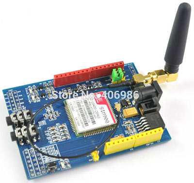

### [GPS-трекер для авто с отправкой данных на сервер с использованием GSM/GPRS шилда](https://cxem.net/arduino/arduino170.php)

Создаем GPS-трекер для авто:

отправка GPS-данных по GSM/GPRS на интернет-сайт с сохранением в базе данных;

просмотр маршрута авто за определенный интервал времени на web-странице с использованием Яндекс.Карт;

просмотр в реальном времени текущего положения авто на web-странице с использованием Яндекс.Карт.

Используемые компоненты:

1) Плата Arduino UNO 

2) SIM900 GSM/GPRS шилд для Arduino 

3) GPS-модуль VK16E.


#### Описание модуля SIM900 GSM/GPRS.



Arduino GPRS/GSM Shield предоставляет вам возможность использовать сеть мобильной GSM связи для удаленного приема и передачи данных для Arduino-проектов. GPRS/GSM shield позволяет добиться этого с помощью одного из трех способов:  SMS; Аудио (голос, CSD, DTMF); GPRS.

***Основные характеристики GSM модуля SIM900:***

```
четыре диапазона GSM 850/ 900/ 1800/ 1900 МГц;
класс передачи данных GPRS multi-slot class 10/8;
соответствие стандарту GSM фазы 2/2+;
класс мощности 4 (2 Вт в диапазонах 850/ 900 МГц) ;
класс мощности 1 (1 Вт в диапазонах 1800/1900 MГц) ;
управление AT командами (GSM 07.07 ,07.05 и фирменные AT команды SIMCom) ;
аудиокодеки HR, FR, EFR, AMR, подавление эха;
CSD до 14.4кбит/с;
PPP-стек;
встроенный стек TCP/IP, UDP/IP;
протоколы HTTP и FTP;
протокол защищенных сокетов SSL;
декодирование DTMF-тонов;
eMail - формирование и отправка электронных писем посредством АТ-команд;
SMS Autorun - исполнение АТ-команд, полученных по SMS от определенного абонента;
2.5Mb user memory - встроенная память для пользовательских данных;
MMS - формирование, дополнение пользовательскими файлами и отправка с помощью АТ-команд;
AMR play - воспроизведение аудиофайлов в динамик или в сторону удаленного абонента;
Jamming Detection - функция обнаружения глушения сигнала;
FOTA - обновление прошивки модуля по беспроводному каналу;
Easy Scan - получение информации об окружающих базовых станциях без подключения SIM-карты;
PING - проверка доступности адреса в Internet посредством обмена ICMP пакетами;
```

***Особенности данного шилда:***

```
совместимость с Arduino Mega;
слот для карт SD ( включение/отключение при помощи перемычки);
программное и аппаратное обеспечение последовательного порта: может общаться с Arduino через последовательный порт программного обеспечения (D7 / D8) или последовательный порт (D0 / D1);
интерфейс FTDI;
слот батарейки для RTC;
10 цифровых входов/выходов GPIO;
2 ШИМ  выхода;
I2C интерфейс
```

Данный шилд имеет два способа включения – аппаратный (кратковременное нажатие кнопки PWRKEY) и программный (используется выход D9 Arduino).

***Получение GPS-данных***

Модуль GPS V.KEL 16 один из самых дешевых и простых. Тем не менее имеет батарейку для сохранения данных о спутниках. По даташиту, холодный старт должен занимать 39 секунд, у меня это заняло примерно 20 минут. Следующий старт примерно 2 минуты. 


Основное, что можно делать с этим приемником — читать данные по протоколу NMEA с TX пина. Уровни — 5V, скорость — 9600 бод. Для подключения к Arduino используем программный UART на пинах 2 и 3. Для чтения данных используем библиотеку TinyGPS.

***Отправка данных на сервер (GSM/GPRS shield)***

Подключаемся к Arduino к контактам 7 и 8. 

Для получения страницы по определенному URL нужно послать следующие команды:

```
AT+SAPBR=1,1                              //Открыть несущую (Carrier)
AT+SAPBR=3,1,"CONTYPE","GPRS"             //тип подключения - GPRS
AT+SAPBR=3,1,"APN","internet.beeline.ru"  //APN, для Билайна - internet
AT+HTTPINIT                               //Инициализировать HTTP 
AT+HTTPPARA="CID",1                       //Carrier ID для использования.
// Собственно URL, после sprintf с координатами
AT+HTTPPARA="URL","http:/????????.ru/gps_tracker/gps_tracker1.php?id_avto=?N&lat=XXXXXlon=YYYYY"     
AT+HTTPACTION=0                           //Запросить данные методом GET
AT+HTTPREAD                               //дождаться ответа
AT+HTTPTERM                               //остановить HTTP
```
Предусмотрим еще один момент - при написании серверной части и web-интерфейса  предусмотрим получение и вывод результатов для нескольких модулей (id_avto=N), поставим переключатель на 3 позиции, что позволит получать информацию от 8 транспортных средств. 

***Написание скетча на Arduino***

Чтобы не отправлять данные во время стоянки транспортного средства, отправлять будем данные, только если GPS данные будут изменяться на значение, указанное в константе MINCANGE.

Интервал отправки данных - константа INTERVALSEND мсек. Наличие двух активных программных последовательных портов приводит к ошибкам получения/отправки данных, поэтому приходится переключать  состояние программных последовательных портов для работы с каждым шилдом.

GPRS.end(); gpsSerial.begin(9600);

В процедуре setup() - выбор номера модуля для отправки данных на сервер (id_avto=) - считывается из трех переключателей.

***Скетч: gps-treker-dlya-avto-s-otpravkoj-dannyh-na-server.ino***

```
#define INTERVALSEND 30000
#define MINCHANGE 100
 
#include "SoftwareSerial.h"
SoftwareSerial GPRS(7, 8);
int onModulePin= 9;
char aux_str[150];
char aux;
char data[512];
int data_size;
uint8_t answer=0;
 
 
#include "TinyGPS.h"
TinyGPS gps;
//Tx, Rx 
SoftwareSerial gpsSerial(2, 3);
long lat, lon;
long endlatsend=0; 
long endlonsend;
unsigned long time1,date1;
unsigned long age;
bool newdata = false;
unsigned long millis1=0;
unsigned long millissend=0;
unsigned long millisdata=0;
 
 
char apn[]="internet.beeline.ru";
char url[150];
String surl="http://yoursite/gps_tracker/gps_tracker1.php?id_avto=";
int id_avto=1;
 
void setup()
  {
  GPRS.begin(19200);               // the GPRS baud rate   
  Serial.begin(9600);             // the Serial port of Arduino baud rate.
  //gpsSerial.begin(9600);
  Serial.println("Starting...");
  pinMode(onModulePin,OUTPUT);
   
  pinMode(12,OUTPUT);
  digitalWrite(12,LOW);
   
  power_on();
  delay(3000);
  //sendATcommand("AT", "OK", 2000);
  //delay(3000);
  // sets APN , user name and password
  sendATcommand("AT+SAPBR=3,1,\"CONTYPE\",\"GPRS\"", "OK", 2000);
  snprintf(aux_str, sizeof(aux_str), "AT+SAPBR=3,1,\"APN\",\"%s\"", apn);
  sendATcommand(aux_str, "OK", 2000);
  while (sendATcommand("AT+SAPBR=1,1", "OK", 2000) == 0)
    {
    delay(2000);
    }
  delay(1000);
  }
 
void loop() 
  {
    digitalWrite(12,HIGH);
    GPRS.end();gpsSerial.begin(9600);
    while (millis() - millis1 < 2000) 
      {
      if (readgps())
        newdata = true; 
      }   
    if (newdata) 
      {
      gps.get_position(&lat, &lon, &age);
      millisdata=millis();
      Serial.print("lat=");Serial.print(lat);
      Serial.print("  lon=");Serial.print(lon);     
      gps.get_datetime(&date1, &time1, &age);
      Serial.print(" date=");Serial.print(date1);
      Serial.print("  time=");Serial.println(time1);     
      newdata=false;
      }
   //if(millis()-millissend>INTERVALSEND && millis()-millisdata<INTERVALSEND
      //&& abs(lat-endlatsend)>MINCHANGE && abs(lon-endlonsend)>MINCHANGE)
  if(millis()-millissend>INTERVALSEND && millis()-millisdata<INTERVALSEND
      && abs(lat-endlatsend)>MINCHANGE && abs(lon-endlonsend)>MINCHANGE
      )
     {
     GPRS.begin(19200);gpsSerial.end();
     // Initializes HTTP service
     answer = sendATcommand("AT+HTTPINIT", "OK", 10000);
     if (answer == 1)
       {
        // Sets CID parameter
        answer = sendATcommand("AT+HTTPPARA=\"CID\",1", "OK", 5000);
        if (answer == 1)
          {// Sets url 
           endlatsend=lat;endlonsend=lon;
           String surl1=set_url_avto()+"&lat="+String(lat)+"&lon="+String(lon);
           surl1+="&date="+String(date1)+"&time="+String(time1);
           surl1.toCharArray(url,surl1.length()+1);
           snprintf(aux_str, sizeof(aux_str), "AT+HTTPPARA=\"URL\",\"%s\"", url);
           answer = sendATcommand(aux_str, "OK", 5000);
           if (answer == 1)
           {// Starts GET action
           answer = sendATcommand("AT+HTTPACTION=0", "+HTTPACTION:0,200", 10000);
           if (answer == 1)
             {
             sprintf(aux_str, "AT+HTTPREAD");
             sendATcommand(aux_str, "OK", 5000);
             }
           else
             {
             Serial.println("Error getting the url");
             }
           }
         else
           {
           Serial.println("Error setting the url");
           }
         }
       else
         {
         Serial.println("Error setting the CID");
         }    
       }
    else
       {
       Serial.println("Error initializating");
       }
    sendATcommand("AT+HTTPTERM", "OK", 5000);
    millissend=millis();
    }
  else
    Serial.println("data not change!!!");
  millis1=millis();
  GPRS.begin(19200);gpsSerial.end();
  }
// отправка AT-команд
int8_t sendATcommand(char* ATcommand, char* expected_answer, unsigned int timeout)
  {
   uint8_t x=0,  answer=0;
   char response[150];
   unsigned long previous;
 
   memset(response, '\0', 150);    // Initialize the string
   delay(100);
   while( GPRS.available() > 0) GPRS.read();    // Clean the input buffer
   GPRS.println(ATcommand);    // Send the AT command 
   x = 0;
   previous = millis();
   // this loop waits for the answer
   do{
     if(GPRS.available() != 0)
       {    
       // if there are data in the UART input buffer, reads it and checks for the asnwer
       response[x] = GPRS.read();
       //Serial.print(response[x]);
       x++;
       // check if the desired answer  is in the response of the module
       if (strstr(response, expected_answer) != NULL)    
         {
         answer = 1;
         }
       }
    }
    // Waits for the asnwer with time out
    while((answer == 0) && ((millis() - previous) < timeout));    
    Serial.println(response);
        return answer;
  }
// программное включение питания
void power_on()
  {
  uint8_t answer=0;
  //answer = sendATcommand("AT+CPOWD=1", "OK", 2000);
  pinMode(onModulePin,OUTPUT);
  // checks if the module is started
  digitalWrite(onModulePin,LOW);
  delay(1000);
  digitalWrite(onModulePin,HIGH);
  delay(2000);
  digitalWrite(onModulePin,LOW);
  delay(3000);
  answer = sendATcommand("AT", "OK", 2000);
  if (answer == 0)
    {
    digitalWrite(onModulePin,LOW);
    delay(1000);
    digitalWrite(onModulePin,HIGH);
    delay(2000);
    digitalWrite(onModulePin,LOW);
    delay(3000);
    Serial.println("POWER!!!!");
     
       
    // power on pulse
    digitalWrite(onModulePin,HIGH);
    delay(3000);
    digitalWrite(onModulePin,LOW);
    // waits for an answer from the module
    while(answer == 0)
      {  
      // Send AT every two seconds and wait for the answer   
      answer = sendATcommand("AT", "OK", 2000);    
      }
    }
  }
// проверка наличия данных gps
bool readgps() 
  {
  while (gpsSerial.available())
    {
    int b = gpsSerial.read();
    //в TinyGPS есть баг, когда не обрабатываются данные с \r и \n
    if('\r' != b) 
      {
      if (gps.encode(b))
          return true;
      }
    }
  return false;
  }
   
 String set_url_avto()
  {
  String surl1;
  if(digitalRead(14)==1)
    id_avto=id_avto+1;
  if(digitalRead(15)==1)
    id_avto=id_avto+2;
  if(digitalRead(16)==1)
    id_avto=id_avto+4;
  surl1=surl+String(id_avto);
  Serial.print("surl1=");Serial.println(surl1); 
  id_avto=0;
  return surl1; 
  }
  ```

***Отправка данных на сервер - обработчик скрипт gps_tracer1.php. ***

Скрипт обрабатывает GET-данные и записывает их в базу данных.

```
<?php
 require_once("mybaza.php");
 $id_avto=$_GET[id_avto];
 $lat=$_GET[lat]/100000;
 $lon=$_GET[lon]/100000;
 $data=date('Y-m-d H:i:s');
 $query1="INSERT into gps_tracker SET
           id_avto=".$id_avto.",lat=".$lat.",lon=".$lon.",
           data='".$data."' ";
   if(!mysql_query($query1))
    echo "error=".$query1;  
  else
    echo "OK";
?>
```

***WEB-интерфейс***

Web-интерфейс -отображение на Яндекс. Картах текущего (последнего переданного) положения либо маршрута за выбранный период. 

Текущее положение - метка , на балуне время для данной метки.

При построении маршрута по меткам строится полигон, на балуне для каждой метки отображается время. Для быстрого построения страницы предусмотрена константа максимального количества меток, следующие метки подгружаются кнопками > и <.

Интерфейс написан с использованием технологии ajax (,библиотека xajax). В прикрепленном архиве файлы сайта и дамп БД.


#### Библиография по SIM900

[SIM900](https://github.com/nthnn/SIM900/)

[GPS Tracker на ардуино своими руками](https://habr.com/ru/articles/196150/)

[Guide to SIM900 GSM GPRS Shield with Arduino](https://randomnerdtutorials.com/sim900-gsm-gprs-shield-arduino/)

[GSM GPRS SIM900 Shield](https://3d-diy.ru/wiki/arduino-moduli/gsm-gprs-sim900-shield/)

[Мобильный телефон на основе Arduino и GSM модуля](https://microkontroller.ru/arduino-projects/mobilnyj-telefon-na-osnove-arduino-i-gsm-modulya/)

[GSM и GPRS модули для Arduino](https://dzen.ru/a/XywdWFmMDRpE_muK)

