## [SIM900 и подключение к Arduino](https://randomnerdtutorials.com/sim900-gsm-gprs-shield-arduino/)

***Схема подключения:***

- Выходы с модуля TX и RX подключить к пинам 2 и 3 на Arduino UNO.
- Общее заземление между модулем и Arduino UNO.
- Не использовать выходы RS232 на боковой панели печатной платы модуля, так как они выдают напряжение +-7 В и могут повредить Arduino. 
- Необходимо использовать контакты последовательного выхода уровня TTL (рядом с подключением антенны).

### [SIM900 GPRS GSM Shield Kit для Arduino](https://aliexpress.ru/item/32649551828.html?spm=a2g2w.orderdetail.0.0.28644aa6Y2cp8t&sku_id=59650770966&_ga=2.236838337.1358291795.1752296331-257156806.1703682747)

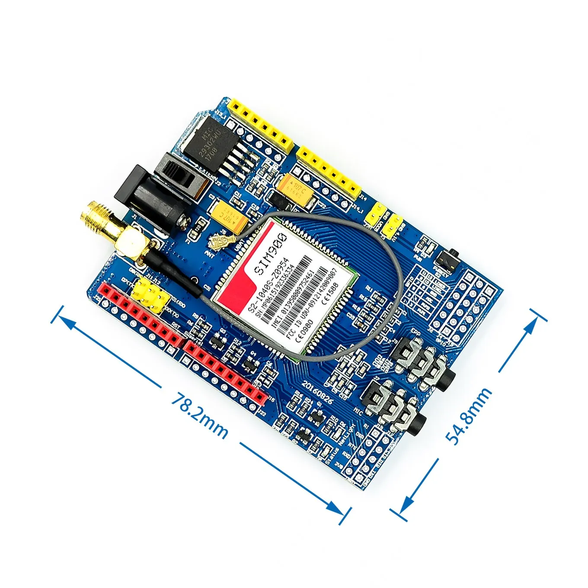

***Описание:***

- 100% новый и высокое качество
- Экран GPRS основан на модуле SIM900 от SIMCOM и совместим с его клонами. 
- GPRS Shield предоставляет вам способ общения с помощью сети сотовых телефонов GSM. 
- Экран позволяет вам получать SMS, MMS, GPRS и аудио через UART путем отправки по командам (GSM 07,07, 07,05 и SIMCOM усилены по командам). 
- Щит также имеет 12 GPIOs, 2 PWMs и ADC модуля SIM900 (они все 2V8 логики), присутствующие на борту.

***Особенности:***

- Четырехдиапазонный 850/900/1800/1900 МГц-будет работать в сетях GSM во всех странах мира.
- GPRS мульти-слот класс 10/8
- GPRS мобильная станция класса B
- Совместим с gsm-фазой 2/2 +
- Класс 4 (2 Вт @ 850/900 МГц)
- Класс 1 (1 Вт @ 1800/1900 МГц)
- Управление через команды AT-стандартные команды: GSM 07,07 и 07,05 | улучшенные команды: SIMCOM AT команды.
- Служба коротких сообщений-так что вы можете отправить небольшое количество данных по сети (ASCII или raw hexadecimal).
- Встроенный Стек TCP/UDP-Позволяет загружать данные на веб-сервер.
- Поддержка RTC.
- Выбор последовательного порта.
- Разъемы для динамиков и наушников
- Низкое энергопотребление-1,5 мА (режим сна)
- Диапазон промышленных температур от-40 °C до + 85 °C
- Размер: 8,5x5,7x2 см (прибл.)
```
- прошивка обычная: Revision:1137B10SIM900M64_ST, к сожалению не ENHANCE ...
- Одна плата имеет бумажную наклейку и версию 6_ST, а вторая глянцевую наклейку с версией 10_ST. 
Обе платы имели настройку обмена 9600 бод. 
Обновил firmware на последнюю 1137B06SIM900M64_ST_ENHANCE (17.07.2015г) модули исправны и работают.
```

### [Руководство по использованию SIM900 GSM GPRS Shield с Arduino](https://randomnerdtutorials.com/sim900-gsm-gprs-shield-arduino/)

> GSM расшифровывается как Global System for Mobile Communications и является международным стандартом мобильной связи.
> 
> GPRS расшифровывается как General Packet Radio Service. GPRS — это мобильная услуга в сетях сотовой связи 2G и 3G.
> 

Плата GSM GPRS особенно полезна, так как позволяет:

- Подключитесь к Интернету через сеть GPRS
- Отправлять и получать SMS-сообщения
- Совершать и принимать телефонные звонки

Благодаря своим возможностям он идеально подходит для проектов с использованием Arduino, таких как:

- Дистанционное управление электронными устройствами — отправка SMS для включения чего-либо;
- Получайте уведомления — отправляйте SMS на свой мобильный телефон, если в вашем доме будет обнаружено движение.
- Получайте данные с датчиков — отправляйте на свой мобильный телефон периодические SMS с ежедневными данными о погоде.

### Предварительные шаги

- ***Покрытие GSM.*** Убедитесь, что у вас есть покрытие в сетях GSM 850 МГц, GSM 900 МГц, DCS 1800 МГц или PCS 1900 МГц. Под GSM мы подразумеваем 2G.
- ***Предоплаченная SIM-Карта.*** Мы рекомендуем вам использовать тарифный план с предоплатой или безлимитный тарифный план для тестирования. В противном случае, если что-то пойдёт не так, вам, возможно, придётся оплатить огромный счёт за сотни SMS-сообщений, отправленных по ошибке. В этом руководстве мы используем тарифный план с предоплатой и безлимитными SMS. 

В защитном чехле используется SIM-карта стандартного размера, а не микро- или нано-SIM. Если у вас микро- или нано-SIM, вы можете приобрести адаптер для SIM-карты.

- ***Отключите блокировку PIN-кода.*** Чтобы использовать SIM-карту с защитой, необходимо отключить блокировку PIN-кодом. Самый простой способ сделать это — вставить SIM-карту в смартфон и отключить блокировку PIN-кодом в настройках безопасности телефона. 

Например, пройти через: Настройки > Расширенные настройки > Безопасность > Блокировку SIM-карты и отключить блокировку sim-карты с помощью pin-кода.

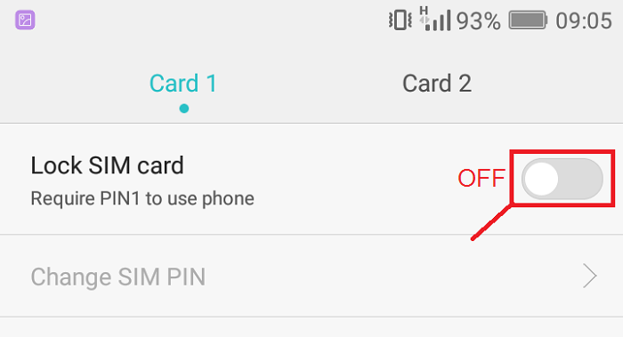

- ***Выбор правильного источника питания.*** На плате есть разъем постоянного тока для подачи питания, как показано на рисунке ниже.

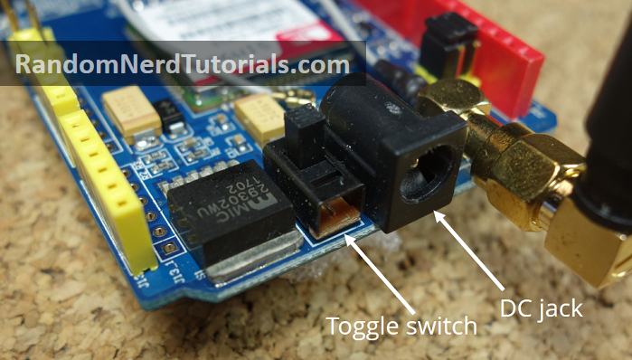

Рядом с разъемом питания находится переключатель для выбора источника питания. Рядом с переключателем на плате есть стрелка, указывающая положение переключателя для использования внешнего источника питания. Переместите переключатель, чтобы использовать внешний источник питания, как показано выше.

> ***Для питания платы рекомендуется использовать блок питания 5В, способный выдавать 2А. Также можно использовать питание 9В, 1А или 12В, 1А.***


### [GPRS Shield v2](https://wiki.amperka.ru/продукты:arduino-gprs-shield-v2)

#### Различие версий

> В первой версии GPRS-Shield напряжение питания шилда составляло не более 9 В.
> 
> В новой ревизии обвязка питания была изменена и теперь допускает питание до 12 В.

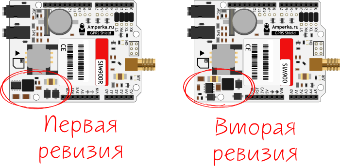


### Аппаратное обеспечение SIM900 GSM GPRS Shield

На рисунке ниже показана задняя сторона платы. На ней есть держатель для SIM-карты и батарейка CR1220 на 3 В для часов реального времени (RTC).

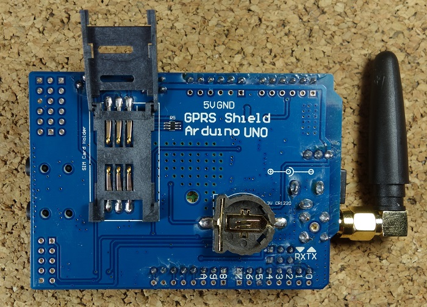

На рисунке ниже показаны наиболее важные компоненты платы, на которые следует обратить внимание.

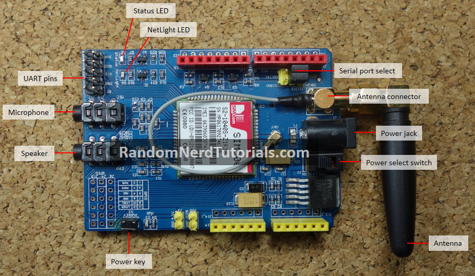

### Приступая к работе

1) Вставьте SIM-карту в держатель SIM-карты — убедитесь, что вы ознакомились с предварительными шагами в предыдущем разделе.

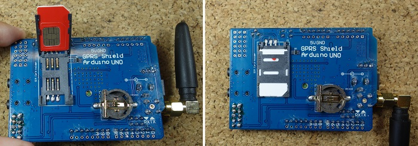

2) Убедитесь, что антенна хорошо подключена.

3) При выборе последовательного порта убедитесь, что перемычка подключена, как показано на рисунке ниже, для использования программного обеспечения.

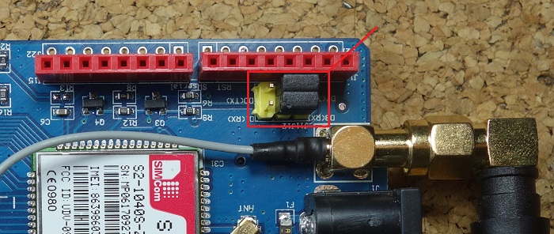

4) Подключите щит к внешнему источнику питания 5 В. Убедитесь, что вы выбрали внешний источник питания с помощью тумблера рядом с разъёмом постоянного тока.

5) Для включения/выключения экрана нажмите и удерживайте кнопку питания около 2 секунд.

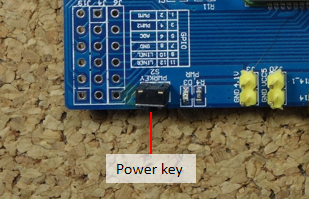

6) Затем загорится индикатор состояния, а индикатор NetLight будет мигать каждые 800 мс, пока не будет найдена сеть. После обнаружения сети индикатор NetLight начнет мигать каждые три секунды.

Примечание: вы можете автоматически включать защиту с помощью программного обеспечения. Узнайте, как это сделать, в разделе Автоматическое включение защиты после примеров кода.

7) Вы можете проверить, правильно ли работает плата, отправив AT-команды из Arduino IDE с помощью программатора FTDI, как мы покажем далее в этом руководстве.

### AT-команды SIM900

- перевести SIM900 в текстовый режим: AT+CMGF=1\r
- отправить SMS на номер: AT+CMGS=НОМЕР_ТЕЛЕФОНА (в международном формате)
- прочесть первое SMS из папки «Входящие»: AT+CMGR=1\r
- прочесть второе SMS из папки «Входящие»: AT+CMGR=2\r
- прочесть все SMS из папки «Входящие»: AT+CMGR=ALL\r
- позвонить по номеру: ATDP+ НОМЕР_ТЕЛЕФОНА (в международном формате)
- завершить вызов: ATH
- поступил входящий вызов: ATA

### [Дополнительная информация по AT-командам](SIM900AT20Command20ManualV103.653745192.pdf)

### Примеры использования команд для sim900

#### [«Все в одном», или Что нового в GSM-модуле SIM900](https://wireless-e.ru/gsm/sim900/)

#### [AT-команды GSM модема на чипе SIM900](https://2150692.ru/faq/47-at-komandy-a6)

#### [GSM модуль и Arduino](https://radiodepector.ru/gsm-modul/)

### Тестирование платы с помощью программатора FTDI

Чтобы проверить, всё ли работает правильно, вы можете протестировать плату, отправив AT-команды с последовательного монитора Arduino IDE. Для этого вам понадобится программатор FTDI.

1) Подключите программатор FTDI к плате GSM, как показано на рисунке ниже.

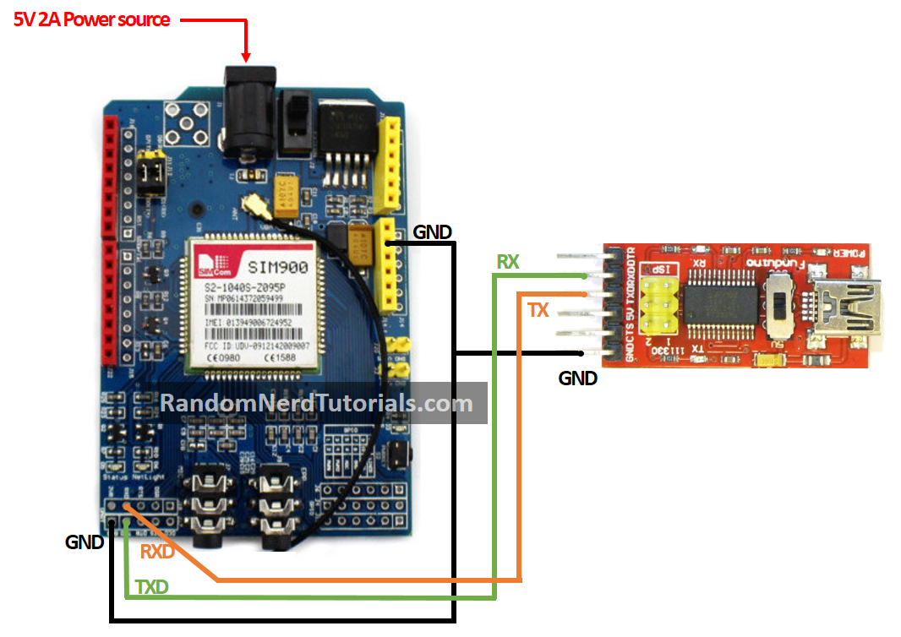

2) Откройте Arduino IDE и выберите нужный COM-порт.

3) Откройте последовательный монитор.

4) Выберите скорость передачи данных 19200 бод — по умолчанию на плате установлено значение 19200 — и возврат каретки. Напишите AT в поле ввода и нажмите Enter.

5) Если всё работает правильно, плата ответит ОК.

### Подключение платы к Arduino

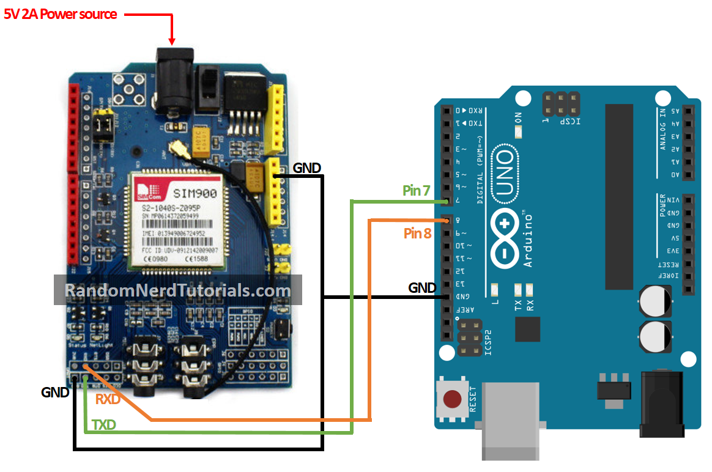

### Отправка SMS-сообщения

```
/*********
  Complete project details at http://randomnerdtutorials.com  
*********/

#include <SoftwareSerial.h>

// Configure software serial port
SoftwareSerial SIM900(7, 8); 

void setup() {
  // Arduino communicates with SIM900 GSM shield at a baud rate of 19200
  // Make sure that corresponds to the baud rate of your module
  SIM900.begin(19200);
  // Give time to your GSM shield log on to network
  delay(20000);   
  
  // Send the SMS
  sendSMS();
}

void loop() { 
  
}

void sendSMS() {
  // AT command to set SIM900 to SMS mode
  SIM900.print("AT+CMGF=1\r"); 
  delay(100);

  // REPLACE THE X's WITH THE RECIPIENT'S MOBILE NUMBER
  // USE INTERNATIONAL FORMAT CODE FOR MOBILE NUMBERS
  
  // В примере от [GPRS Shield v2]
  // gprs.sendSMS("+79263995140", "Hello SMS from Amperka!");
  
  SIM900.println("AT+CMGS=\"+XXXXXXXXXXXX\""); 
  delay(100);
  
  // REPLACE WITH YOUR OWN SMS MESSAGE CONTENT
  SIM900.println("Message example from Arduino Uno."); 
  delay(100);

  // End AT command with a ^Z, ASCII code 26
  SIM900.println((char)26); 
  delay(100);
  SIM900.println();
  // Give module time to send SMS
  delay(5000); 
}

```

В этом коде вы начинаете с подключения библиотеки SoftwareSerial.h и создаёте программный последовательный порт на контактах 7 и 8. (Контакт 7 используется как RX, а контакт 8 — как TX)

```
#include <SoftwareSerial.h>
SoftwareSerial SIM900(7, 8);
```

Созданная функция sendSMS() фактически отправляет SMS. Эта функция использует команды AT: ***AT+CMGF=1\r и AT + CMGS***.

Вам нужно изменить номер мобильного телефона получателя на: (замените ***X*** на номер телефона получателя)

```
SIM900.println("AT + CMGS = \"XXXXXXXXXXX\"");
```

Номер мобильного телефона получателя должен быть указан в международном формате.

Затем в следующей строке вы можете отредактировать текст, который хотите отправить.

```
// ЗАМЕНИТЕ НА СВОЁ СОБСТВЕННОЕ SMS-СООБЩЕНИЕ 
SIM900.println("Пример сообщения от Arduino Uno.")
```

### Чтение полученного SMS-сообщения

Чтобы прочитать входящее SMS, загрузите приведённый ниже код в Arduino. После загрузки подождите 20 секунд, пока плата не установит соединение. Затем протестируйте скрипт, отправив SMS на номер SIM-карты платы. SMS отобразится на последовательном мониторе Arduino со скоростью передачи данных 19200 бод.

```
/*********
  Complete project details at http://randomnerdtutorials.com  
*********/

#include <SoftwareSerial.h>

// Configure software serial port
SoftwareSerial SIM900(7, 8);
//Variable to save incoming SMS characters
char incoming_char=0;

void setup() {
  // Arduino communicates with SIM900 GSM shield at a baud rate of 19200
  // Make sure that corresponds to the baud rate of your module
  SIM900.begin(19200);
  // For serial monitor
  Serial.begin(19200); 
  // Give time to your GSM shield log on to network
  delay(20000);

  // AT command to set SIM900 to SMS mode
  SIM900.print("AT+CMGF=1\r"); 
  delay(100);
  // Set module to send SMS data to serial out upon receipt 
  SIM900.print("AT+CNMI=2,2,0,0,0\r");
  delay(100);
}

void loop() {
  // Display any text that the GSM shield sends out on the serial monitor
  if(SIM900.available() >0) {
    //Get the character from the cellular serial port
    incoming_char=SIM900.read(); 
    //Print the incoming character to the terminal
    Serial.print(incoming_char); 
  }
}
```
В этом коде вы настраиваете модуль на отправку данных SMS на последовательный выход:

```
SIM900.print("AT+CNMI=2,2,0,0,0\r");
```

Вы сохраняете входящие символы из SMS-сообщения в переменной incoming_char. Вы считываете символы с помощью функции SIM900.read().

### Совершение телефонного звонка

```
/*********
  Complete project details at http://randomnerdtutorials.com  
*********/

#include <SoftwareSerial.h>

// Configure software serial port
SoftwareSerial SIM900(7, 8); 

void setup() {
  // Arduino communicates with SIM900 GSM shield at a baud rate of 19200
  // Make sure that corresponds to the baud rate of your module
  SIM900.begin(19200);
  // Give time to your GSM shield log on to network
  delay(20000);

  // Make the phone call
  callSomeone();
}

void loop() {
  
}

void callSomeone() {
  // REPLACE THE X's WITH THE NUMER YOU WANT TO DIAL
  // USE INTERNATIONAL FORMAT CODE FOR MOBILE NUMBERS
  SIM900.println("ATD + +XXXXXXXXX;");
  delay(100);
  SIM900.println();
  
 // In this example, the call only last 30 seconds
 // You can edit the phone call duration in the delay time
  delay(30000);
  // AT command to hang up
  SIM900.println("ATH"); // hang up
}
```

Чтобы совершить звонок, используйте функцию callSomeone(), которая использует команду ATD.

```
SIM900.println("ATD + +XXXXXXXXX;");
```

Вам нужно заменить X на номер телефона, по которому вы хотите позвонить.

Не забудьте подключить микрофон и наушники, чтобы совершить звонок.

В этом примере кода вызов завершается через 30 секунд с помощью команды ATH:

```
SIM900.println("ATH"); 
```

Отбой через 30 секунд не очень полезен, но в качестве примера работает хорошо. Идея заключается в том, что вы используете команду ATH при срабатывании события. Например, подключите к Arduino кнопку, которая при нажатии отправляет команду ATH для завершения вызова.


### [Отправка и получение SMS и звонков с помощью SIM900 GSM Shield и Arduino](https://lastminuteengineers.com/sim900-gsm-shield-arduino-tutorial/)


### Комментарии

1. Можно ли включить эту плату с помощью Arduino, не нажимая на кнопку?

- Есть способ использовать программный триггер, чтобы не нажимать кнопку для включения платы. Для этого нужно подключить D9 на плате к D9 на Arduino и добавить в код следующий фрагмент в функции setup(), который эквивалентен нажатию кнопки питания:

```
digitalWrite(9, HIGH);
delay(1000);
digitalWrite(9, LOW);
delay(5000);
```

2. На некоторых платах нужно припаять контакт ***R13***, см. «Автоматическое включение платы».

- Внутри маркировки R13 есть два крошечных контакта. Вам нужно припаять эти контакты друг к другу.

> При использовании аккумуляторов 18650 следует иметь в виду, что если плата будет постоянно включена, аккумуляторы быстро разрядятся. Поэтому плату нужно включать только тогда, когда требуется отправить сообщение, позвонить и т. д.

> Когда плата подключается к сети, индикатор NetLight должен мигать каждые три секунды (это означает, что устройство правильно подключено к сети).
> Чтобы включить плату, нажмите кнопку питания и удерживайте её около двух секунд. Затем загорится индикатор состояния, а индикатор NetLight будет мигать каждые 800 мс, пока устройство не найдёт сеть. Когда устройство найдёт сеть, индикатор NetLight начнёт мигать каждые три секунды.
> 
> Если устройство не подключается к сети, проблема может быть связана с вашей картой или с GSM-модулем.
> 
> Перед отправкой AT-команд GSM-модуль должен быть подключен к сети.

3. У меня возникла проблема на первом этапе! Индикатор сети мигает только раз в секунду и остаётся в таком положении в течение длительного времени… Это значит, что он не может подключиться к сети. Я не знаю почему?

Мой модуль подключён к источнику питания 9В 1А,
SIM-карта установлена правильно.

- Поддерживает ли ваше местоположение сеть 2G?
SIM900 - это сетевое устройство 2G. 

Найдите список AT-команд и узнайте больше о качестве сигнала, подключениях и т. д.
Вы можете начать с проверки качества сигнала с помощью команды, например — SIM900.println(“AT+CSQ”) — (и отправить вывод обратно в последовательный порт). 

Также проверьте команды AT+COPS? и AT+CREG? в различных вариантах…

Так вы узнаете, работает ли ваша антенна (CSQ) и есть ли несущие частоты, к которым вы можете подключиться или к которым уже подключены.

Вы можете узнать гораздо больше о своей плате и подключении с помощью AT-команд, даже без подключения к сети (или до него) !

И я признаю, что подключить эти платы по-прежнему сложно… но вы узнаете гораздо больше о своей плате, попробовав эти команды 🙂

4. Хотя мне удалось отправить SMS с помощью GSM-модуля, я не могу его прочитать.

Я выполнил описанные вами действия по настройке скорости передачи данных и т. д., но SMS-сообщение по-прежнему не отправляется на последовательный порт.

- Убедитесь, что на вашей SIM-карте не установлен PIN-код (это распространённая ошибка).

5. Может в примерах кода не хватает:
```
// Импортируем библиотеку GSM
#include ...
```
- В примерах для связи с SIM900 через последовательный порт используется библиотека SoftwareSerial. Нет необходимости подключать другую библиотеку.

6. Можно ли использовать контакты 0 и 1 вместо контактов 7 и 8? Если да, то нужно ли мне по-прежнему использовать библиотеку SoftwareSerial? Я использую Arduino UNO R3.

- Если вы используете контакты 0 и 1, значит, вы используете аппаратный последовательный порт. Значит, вам не нужна эта библиотека.
Если вы собираетесь использовать аппаратный последовательный порт, вам нужно изменить перемычки на плате, чтобы использовать аппаратный последовательный порт.
[На этом изображении показаны перемычки для использования программного последовательного порта ](https://i0.wp.com/randomnerdtutorials.com/wp-content/uploads/2017/08/software-serial.jpg?w=700&ssl=1), которые необходимо заменить на аппаратный последовательный порт.

7. Может ли SIM-карта sim900 подключаться к сети 4G?

- SIM900 не работает с 4G.
Вам нужен другой модуль, например SIM800C.

8. Могу ли я использовать SIM-карту любого типа? Операторы продают SIM-карты для сетей 2G и USIM-карты для сетей 3G/4G. Будет ли это работать с SIM-картой любого типа?

- Плата работает с любым типом SIM-карты. Например, вы можете использовать карту 3G или 4G. Но модуль будет работать только в том случае, если в вашем регионе есть сеть 2G.

9. Я хочу совершать автоматические звонки (с Arduino) определённому человеку, и после того, как он ответит, должна включиться запись. Есть ли какое-то событие, которое сообщает мне о том, что человек ответил на исходящий звонок?

- [Надеюсь, это поможет](https://stackoverflow.com/questions/63240900/sim900-gsm-module-how-to-check-if-the-outgoing-call-is-answered)

> 2G — это система GSM, которая обеспечивает телефонные звонки и SMS. Если вы полностью отключите 2G, то, думаю, у вас не будет телефонной связи, поскольку она по-прежнему работает на 2G. (3G/4G/5G — это сервисы передачи данных, работающие параллельно с GSM.)
> 
> Поскольку SIM900 поддерживает 2G, и вы используете его только для отправки/получения SMS, я думаю, он продолжит работать. Если вы используете функции передачи данных через 2G, то, возможно, они будут каким-то образом отключены, но при этом SMS и телефонная связь будут работать. Но, скорее всего, им ничего не стоит поддерживать эту функцию, поскольку она в любом случае является частью GSM, которая по-прежнему необходима для базовой телефонной связи.

***Ноэль, 1 марта 2023 года, 11:02***

***Стоит отметить несколько моментов:***

На некоторых из этих плат вместо основного чипа SIM900 установлен SIM900A. Это становится очевидным, если посмотреть на плату или на реальные фотографии, а не на старые «стандартные» фотографии от интернет-поставщиков. Разница в том, что ***SIM900A работает в двух диапазонах, а не в четырёх***. У меня есть несколько плат, и одна из них с SIM900A не подключается, несмотря на то, что я использую SIM-карты, которые работают на других платах.

Существует также версия этой платы немного меньшего размера без держателя аккумулятора и слота для SIM-карты на задней панели. В них также нет разъёмов для подключения телефона и чипа RTC. Отсутствие RTC не является проблемой, так как время можно определить по входящим звонкам и сообщениям.
Удачи вам в ваших проектах…

