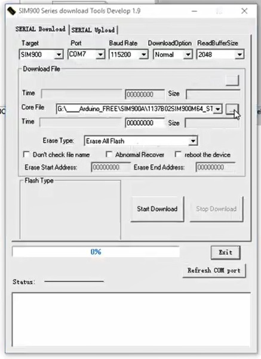

## [SIM900A]()

SIM900A SIM900 MINI V4.0 беспроводной модуль передачи данных GSM GPRS комплект платы с антенной C83, получен от AliExpress 7 сентября 2023

### [Как заставить работать sim900a в наших сетях](https://habr.com/ru/articles/391555/)

### [Превращаем SIM900A в SIM900 и заставляем работать в наших сетях](https://yandex.ru/video/preview/5323166599610369011)

### [Делаем из китайского GSM SIM900A расширенный SIM900](https://yandex.ru/video/preview/17710977013799739340)

Видео о том, как купив дешевый модуль SIM900A, сделать из него полноценный SIM900 и даже с расширенными возможностями как DTMF декодинг, пользовательские аудиофайлы на рингтоны, и прочие плюшки.
Понадобится сам модуль на SIM900A и USB-TTL конвертер.
Почему SIM900, а не SIM800L? Ответ прост - уж больно много проблем у ВАС возникает при работе с SIM800L и к тому же GPRS гораздо стабильнее на SIM900


Прошивка и программа для прошивки тут: [https://yadi.sk/d/vwWr2ODi3EEb5J](https://yadi.sk/d/vwWr2ODi3EEb5J)

годится не каждый SIM900A, а ОБЯЗАТЕЛЬНО с 64МБ памяти, ссылка именно на него ниже

SIM900A 64МБ http://ali.pub/guqyh
USB TTL конвертер PL2303 http://ali.pub/8dctg

Наша группа вконтакте: https://vk.com/arduino_nodemcu_esp8266

### [2024-05-27 Прошить получилось!](#)




После прошивки перегружаем модем, ждем, когда он будет готов (смотрим через com-порт ардуино) и проверяем модем следующими командами:

AT
AT+IPR=?
AT+GMR - спрашиваем файл прошивки

2024-05-27 Получилось!

### [2025-07-23 Получился контакт SIM900a и Terminal-v1.9b!](#)

- Разобрался с контактами SIM900a:


- Сделал 5 вольтовое подключение к USB UART на основе следующего рисунка:


```
+5V от блока питания на 18650  =>  VCC/4-5V на SIM900a
GND от блока питания на 18650  =>  GND/0V на SIM900a

TXD от USB UART  =>  RXD 5V на SIM900a
RXD от USB UART  =>  TXD 5V на SIM900a
GND от USB UART  =>  GND при контактах 5V на SIM900a
``` 

- Сделал подключение SIM900a к Terminal-v1.9b на основе статьи ***[GSM модуль SIM900A. Прошивка и использование](https://robotclass.ru/articles/gsm-sim900a-configure-and-use/)***

Установил частоту передачи 9600 Baud rate и поставил галочку ***+CR*** для автоматического формирования "возврата каретки" и подсоединился к SIM900a.


> Ранее, работая c SIM900 через IDE Arduino, думал, что плата не работает, так как через последовательный порт видел только "эхо" - повторение вводимых строк после нажатия "enter". Теперь понятно - не уходил в порт "возврат каретки".

- Отработал команды в соответствии со статьей:

```
----- Проверить связь:
команда - AT
---
ответ   - OK

----- Получить идентификатор прошивки:
AT+GMR
---
Revision:1137B02SIM900M64_ST_ENHANCE
OK

----- Узнать IMEI?:
AT+GSN
---
012207000000015
OK

----- Определить состояние:
AT+CPAS
---
+CPAS: 0     - готов к работе
OK

----- Получить информацию об операторе:
AT+COPS?
---
+COPS: 0,0,"MTS RUS"
OK

----- Выполнить звонок:
ATD+79214524295;
OK

----- Определить состояние:
AT+CPAS
---
+CPAS: 4    - голосовое соединение
OK

----- Завершить вызов
ATH0
---
OK

----- Определить состояние:
AT+CPAS
---
+CPAS: 0
OK
```

### [Basic AT Commands for SIM900A GSM/GPRS Module command](https://gist.github.com/itoonx/c36d767594172d7c222447d7fc3614bf)

```
TO CHECK THE MODEM:
---------------------------------------------------
AT
  OK

TO CHANGE SMS SENDING MODE:
---------------------------------------------------
AT+CMGF=1
         OK

TO SEND NEW SMS:
---------------------------------------------------
AT+CMGS="MOBILE NO."
<MESSAGE
{CTRL+Z}

ПРЕДПОЧТИТЕЛЬНОЕ ХРАНЕНИЕ SMS-СООБЩЕНИЙ:
---------------------------------------------------
AT+CPMS=?
         +CPMS: ("SM"),("SM"),("SM")
         OK

AT+CPMS?
        +CPMS: "SM",19,30,"SM",19,30,"SM",19,30

TO MAKE A VOICE CALL:
---------------------------------------------------
ATD9876543210;

TO REDIAL LAST NO:
---------------------------------------------------
ATDL

ДЛЯ ПРИЕМА ВХОДЯЩЕГО ВЫЗОВА:
---------------------------------------------------
ATA

ЧТОБЫ ПОВЕСИТЬ ТРУБКУ ИЛИ ПРЕРВАТЬ ВЫЗОВ:
---------------------------------------------------
ATH

ЧТОБЫ УСТАНОВИТЬ CКОРОСТЬ ПЕРЕДАЧИ ДАННЫХ В БОДАХ:
---------------------------------------------------
AT+IPR=?         {Просмотреть значения скорости передачи данных в бодах}

AT+IPR=0         {Перевести модем в режим автоподачи звука}

ВЫБОР ОПЕРАТОРА:
---------------------------------------------------
AT+COPS=?
         OK

AT+COPS?
        +COPS: 0,0,"AirTel"
        OK

УСТАНОВИТЕ КОДЫ СОТОВОЙ СВЯЗИ ДЛЯ ИНДИКАЦИИ ВХОДЯЩИХ ВЫЗОВОВ:
---------------------------------------------------
AT+CRC=?
        +CRC: (0-1)
        OK

AT+CRC?
        +CRC: 0
        OK

AT+CRC=1
        OK

??? +CRING: VOICE

READ OPERATOR NAMES:
---------------------------------------------------
AT+COPN=?
        OK

AT+COPN
        +COPN: "472001","DHIMOBILE"
        +COPN: "60500
        +COPN: "502012","maxis mobile"
        +COPN:
        +COPN: "502013","TMTOUCH"
        +COPN
        +COPN: "502016","DiGi"
        +COPN: "502017","TIMECel""
        +COPN: "502019","CELCOM GSM"

GPRS COMMANDS:
---------------------------------------------------
Command               Description

AT+CGATT              ПОДКЛЮЧЕНИЕ/ОТКЛЮЧЕНИЕ ОТ УСЛУГИ GPRS
AT+CGDCONT            DEFINE PDP CONTEXT
AT+CGQMIN             ПРОФИЛЬ КАЧЕСТВА ОБСЛУЖИВАНИЯ (МИНИМАЛЬНЫЙ)
AT+CGQREQ             ПРОФИЛЬ КАЧЕСТВА ОБСЛУЖИВАНИЯ (ПО ЗАПРОСУ)
AT+CGACT              PDP CONTEXT ACTIVATE OR DEACTIVATE
AT+CGDATA             ENTER DATA STATE
AT+CGPADDR            SHOW PDP ADDRESS
AT+CGCLASS            GPRS MOBILE STATION CLASS
AT+CGEREP             КОНТРОЛИРОВАТЬ НЕЖЕЛАТЕЛЬНЫЕ СОБЫТИЯ GPRS
AT+CGREG              NETWORK REGISTRATION STATUS
AT+CGSMS              SELECT SERVICE FOR MO SMS MESSAGES
AT+CGCOUNT            СЧЕТЧИКИ GPRS-ПАКЕТОВ

```

### [Arduino и GSM-модуль SIM900A. Как прошить и заставить работать?](https://voltiq.ru/arduino-and-sim900a/)

### [GSM SIM900A Arduino Tutorial (Easy 4 Step)](https://www.instructables.com/GSM-SIM900A-Arduino-Tutorial-Easy-4-Step/)

2024-05-26 Поработал со статьей, sim900a живой, команды подтверждает, но звонок и смс на мой номер ушли "в никуда".

### [SIM900A GSM Module](https://microcontrollerslab.com/sim900a-gsm-module-pinout-examples-applications-datasheet/)

2024-05-26 Просмотрел, ничего не делал

### [GSM модуль SIM900A - как заставить работать?](http://forums.kuban.ru/f1060/gsm_modul-_sim900a_-_kak_zastavit-_rabotat--5363026.html)

Гость
1 - 07.02.2014 - 09:34
Разобрался.
В общем, в результате экспериментов получилось его реанимировать и теперь он работает как полноценный SIM900 с прошивкой All-in-One (ENHANCE). Аппаратная версия моего модуля S2-1040V-Z095R (64Mb).
Нужно в "SIM900 Series download Tools Develop 1.9" открыть файл прошивки, выбрать СОМ-порт, "Erase Type" установить в "Erase All Flash", присоединится к модулю через интерфейс "DEBUG", подать питание и нажать POWERKEY.
По ссылка ниже можно найти программу для прошивки и сами прошивки (32Mb и 64Mb):
http://gauthierlerouzic.blogspot.ru/.../label/SIM900A
А здесь лежит прошивка ENHANCE:
ftp://ftp.macrogroup.ru/Support/SimC...Sim900/Sim900/
Спасибо всем ответившим ))	
Гость
2 - 09.02.2014 - 20:54
Хочешь сделать дело хорошо- делай сам!

### [Guide to SIM900 GSM GPRS Shield with Arduino](https://randomnerdtutorials.com/sim900-gsm-gprs-shield-arduino/)

### [GSM и GPRS модули для Arduino](https://arduinomaster.ru/datchiki-arduino/gsm-gprs-modul-arduino/)

### [Как заставить работать sim900a в наших сетях](https://habr.com/ru/articles/391555/)

