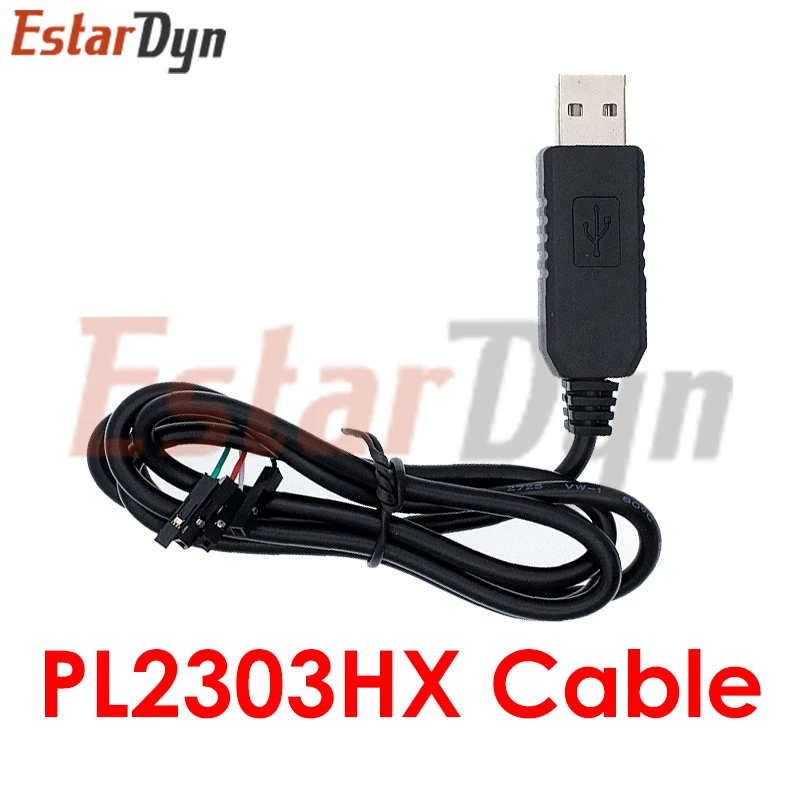
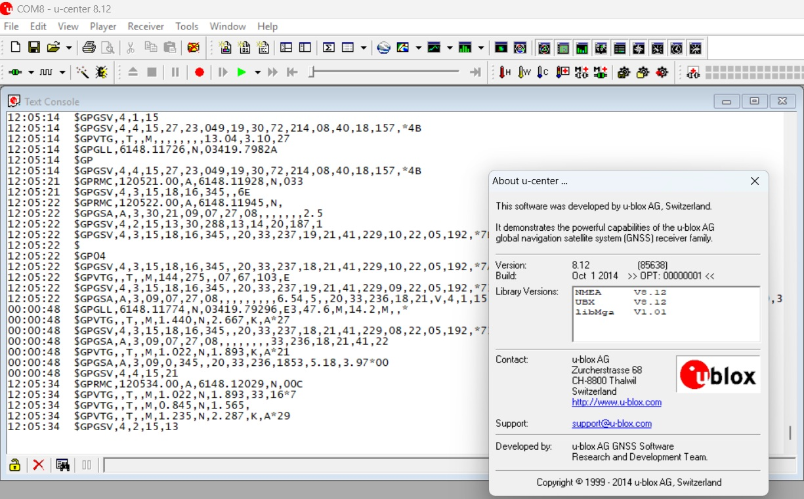
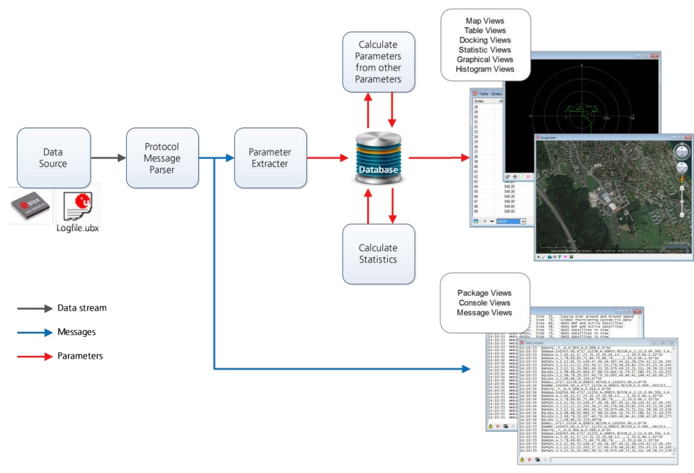
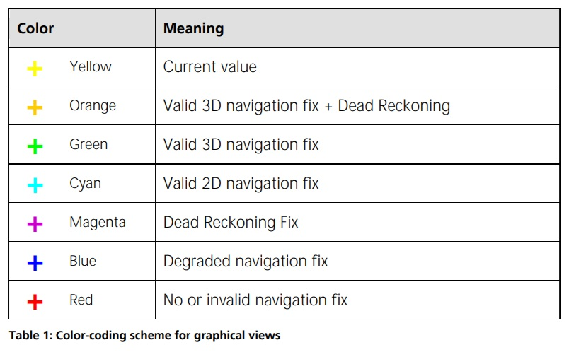
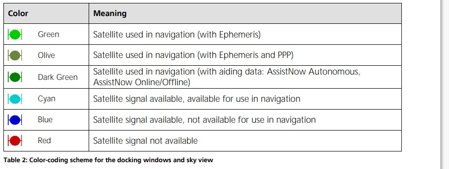
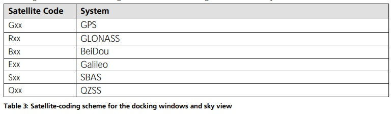
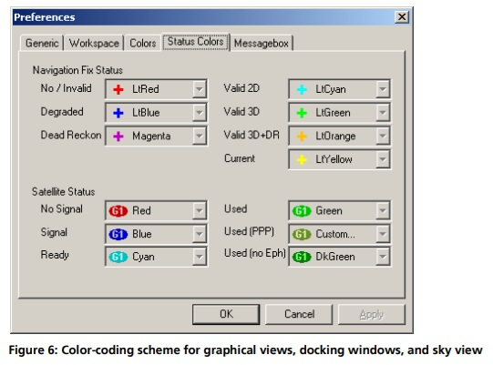

## U-Center и VK2828U7G5LF учимся работать

U-Center, cсылка на скачивание – [https://www.u-blox.com/en/product/u-center-windows](https://www.u-blox.com/en/product/u-center-windows)

Программа u-center используется для работы с GNSS-приемниками от фирмы U-Blox. С помощью этого программного обеспечения можно тестировать точность позиционирования, изменять конфигурацию ресивера и проводить общую диагностику, обрабатывать полученные данные и отображать их в режиме реального времени.

Координаты приемник получает с помощью GPS, ГЛОНАСС.  Полученную информацию можно экспортировать и показывать в картах Google Maps, Google Earth. Программа позволяет создавать двухмерные диаграммы, гистограммы и другие виды графиков.

u-center можно использовать при работе с несколькими приемниками.

Возможности программного обеспечения U-Center:

- Работа с Windows;
- Чтение NMEA , SiRF данных, UBX;
- Вывод полученных данных в виде текста и графиков;
- Запись данных, и воспроизведение;
- Полное управление модулем GPS;
- Возможность изменения конфигурации GPS-модуля;
- Запись новой конфигурации в модуль;
- Запись конфигурации в файл формата .txt;
- Обновление прошивки модуля;
- Возможность холодного, теплого и горячего старта модуля.

Программа позволяет оценивать работоспособность приемника, анализировать его быстродействие и устанавливать его настройки. 

#### [Описание протокола NMEA 0183](https://wiki.iarduino.ru/page/NMEA-0183/)

#### [GPS модуль Neo-6M. Пример настройки NMEA](http://ucheba33.ru/?p=1150)

#### [Getting Started with U-Center for u-blox](https://learn.sparkfun.com/tutorials/getting-started-with-u-center-for-u-blox/all)

#### [Доработка и настройка USB GPS приемника на чипе u-blox](https://www.drive2.ru/l/715055843325789482/)

#### [U center инструкция на русском](https://manuali.top/u-center-instrukcziya-na-russkom/)

#### [How To Optimize GPS Receiver Settings in U-Center To Get More Satellite Locks](https://oscarliang.com/gps-settings-u-center/)

#### [GPS U-CENTER Configuration](https://synerflight.com/synerduino-documentation/gps-configuration/)

#### [GNSS, GPS или ГЛОНАСС: какая навигационная система лучше?](https://www.sinsmarts.com/ru/blog/gnss-vs-gps-vs-glonass-which-is-the-best-navigation-system/)

#### [ч1. Инструкция: подключение GPS модуля с Али к Starline](https://www.drive2.ru/b/672390394121564607/)

#### [ч2. Инструкция: подключение GPS модуля с Али к Starline](https://www.drive2.ru/b/672405512406459617/)

### [Кабель-адаптер конвертер USB на RS232 UART TTL PL2303](https://market.yandex.ru/card/kabel-adapter-konverter-usb-na-rs232-uart-ttl-pl2303-gsmin-ak86-chernyy/103240338050?do-waremd5=y8TovwuyO-VgB6fE9Y0vvA&sponsored=1&cpc=l-zGuBc4NMBdm5WLdyAOhOCguGYRc_PDlveE-hjg8LpeEXhVuvugRg-q8lnS1lTp_U4DfcxqiQ3BpLqEACwYB8aHqu7XZNcpPja2uaP9v6bP4d7RlVGuE8rfolC-LOj1pn4L0050-Wo4arzzy8r-walEgRxVmq3DxF4G1gdDaYo_hlk5wXexGmLOZYZbO03FnSg29-WcaxV-57OQc57h0kdxsY6SY05iywKjnpeh8t64FF_hO3zg1QvHF2FsbMRtUkvFLZ6es9uUImDL5-XEmUVDc6XDwNh03cKu0EjnD6L8CiCUyqvJfZs1oNQbwYsDnz7-WcEdvtcocIx3S4aO_GKfmKpMRdawT9PHFj9oh21SNmgkM58Bd9Bq527IsAb7Xa7S3QEQvtQEPHmMDqqPG_i3AnAk3tfz37vVq2KLwXNpt-rYXMtYD2r9zXyAKUT8HTpJyS5pp23uliPuk8Tq4Q-_RPWax42PKRzTTHK2lQeVnf_oE2zPEj8riOOlS9n4yzlO50JHg5sJ0HNqKxrxT9z5XsaAGit8ISrXATSXv78kZi-iuprzwMX7NV91ptdMA__Se1b14I_6fcMz5BYkclB6ybqY8egisjjg6vLnfwSNsksxXs0_zon8qgeY3NR9LDkRqlMTxSw7Ss0q7b0aLDhXp5KfjnWl-jR7DB-56VaU20nEGXgzEQ%2C%2C&ogV=-4)

Последовательный кабель USB к UART TTL основан на микросхеме серии PL2303, эмулирующей UART интерфейс. Кабель запитывается от 5-вольтового напряжения, получаемого от компьютерного порта USB. Поддерживает 3.3- и 5-вольтовые уровни TTL сигналов.

USB-TTL преобразователь служит для подключения микроконтроллеров к ПК, через порт UART. Микросхема PL2303, создает на ПК виртуальный COM-порт. Конвертер используется для программирования микросхем и микроконтроллеров, поддерживающих уровни сигналов TTL (0 – 5В). Применяется для прошивки различных устройств на микроконтроллерах. При подсоединении к компьютеру создаётся виртуальный COM порт, способный взаимодействовать с другими Arduino устройствами, которые необходимо перепрограммировать.

Кабель совместим со следующими ОС Windows: 98, ME, Vista, XP, 7, 8.

Подсоединяется к компьютеру через USB интерфейс. Для программируемых устройств понадобятся четыре провода, имеющие «мама»-контакты. Провода имеют следующие выводы:

> • Белый – приём данных (RDX);
> 
> • Красный – подсоединение USB (Vcc);
> 
> • Зелёный – передача данных (TXD);
> 
> • Чёрный – минус питания (GND).

- Выходное напряжение: 3.3, 5 В
- Предохранитель: до 500 мА
- Длина провода: 90 см



### Документация по U-Center UBX-13005250, R06 06-Jan-2014

Документация для изучения [***u-center, v8.12***](U-center_User_Guide_13005250-R06.pdf): U-center_User_Guide_13005250-R06.pdf



U-center позволяет оценивать, тестировать производительность, разрабатывать и отлаживать чипы и модули позиционирования GNSS. 

U-center позволяет подключаться к продуктам u-blox и предоставляет набор функций для просмотра, регистрации и анализа производительности. В число функций входит: 

- Поддержка приемников u-blox, использующих технологию позиционирования u-blox. u-center может взаимодействовать с этими приемниками, используя либо протокол ***UBX***, либо стандартный протокол ***NMEA-0183***. 

- Поддержка приемников, использующих стандартные строки NMEA.

- u-center предоставляет всю информацию, собранную во время работы устройства GNSS. Все аспекты данных GNSS (местоположение, скорость, время, спутниковое слежение и т.д.) могут отслеживаться и регистрироваться в различных сценариях тестирования для оценки работы приемника.

- Программное обеспечение u-center позволяет анализировать собранные данные с целью изучения таких вопросов производительности, как точность, местоположение и траектория дорожных испытаний, спутниковое слежение, время до первого исправления и т.д. Все обработанные данные могут быть записаны в формате ASCII и перенесены в популярные электронные таблицы для создания дополнительных графиков и статистики. 

- Просмотр с камеры: фотографические данные могут быть сохранены в лог-файле вместе с навигационными данными, а затем воспроизведены в приложении. 

- Экспорт файлов данных в Google Планета Земля и Google Maps. 

- Поддержка (нескольких GNSS) AssistNow Online и AssistNow Offline. 

- Функция записи и воспроизведения данных. 

- Визуализация структурных и графических данных в режиме реального времени. 

- Возможность экспорта в стандартные приложения для ПК. 

- Обзоры стыковки (приборы кабины пилота в режиме реального времени): спутниковая группировка, компас, часы, альтиметр, спидометр, GNSS и спутниковая информация. 

- Загрузка обновлений встроенного по для модулей позиционирования GNSS.

#### 2. Общая информация о отображаемых значениях

- Долгота и широта отображаются в соответствии с данными, выбранными в устройстве GNSS (обычно это WGS-84). Этот параметр можно задать с помощью сообщения UBX-CFG-DAT.

- Время отображается в соответствии с UTC.

- Высота отображается в соответствии либо с MSL (высота над средним уровнем моря или ортометрическая высота), либо
с HAE (высота над эллипсоидом WGS-84). Привязка определяется конфигурацией GNSS.

#### 3. Концепция и философия

Понимание базовой концепции, лежащей в основе u-center, важно для получения максимальной отдачи от этого мощного программного обеспечения для оценки. 



На рисунке представлена архитектура программного обеспечения. Программа получает поток данных либо из COM-порта, либо из файла журнала и разбивает этот поток на протокольные сообщения. Из сообщений извлекаются соответствующие параметры и вставляются в текущий набор данных базы данных.

В текущем наборе данных вычисляются статистические значения параметров. Среднее, минимальное, максимальное и cтандартное отклонение рассчитываются для большинства параметров. Если протокол не предоставляет параметр, u-center пытается вычислить параметр из доступных.

Например, если доступны значения скорости на север и скорости на восток, u-center вычисляет скорость над землей и курс над землей, если только эти данные уже не доступны в протоколе.

При обнаружении новой эпохи (изменения во времени) текущий набор данных сохраняется в базе данных в виде истории. Эта история имеет ограниченный размер. Если размер превышен, u-center сохраняет только самые последние наборы данных, а самые старые удаляются. Размер хронологии может быть изменен. Подробности смотрите в разделе ***3.3***.

u-center предоставляет различные классы просмотров для наблюдения. Большинство просмотров получают свои данные из базы данных, но некоторые получают их непосредственно из сообщения, вообще не используя базу данных. Другие представления обновляются при изменении базы данных.

- ***Представления сообщений***. Отображают и расшифровывают копию каждого известного сообщения. Этот просмотр позволяет детально изучить каждое сообщение, а также может быть использован для настройки устройства GNSS. Подробности приведены в разделе ***4.2.4***.
Представление конфигурации является подмножеством представления сообщений и отображает только сообщение для настройки получателя.

- ***Консольные представления***. Отображают сообщения в текстовой форме. Они особенно полезны для пользователей при разработке программного кода GNSS. Также доступен широкий спектр информации, полезной для оценки и тестирования. Подробности приведены в разделах ***4.2.1, 4.2.2*** и ***4.2.3***.

- ***Графические представления***. Отображают параметры из базы данных в графическом виде. Можно создавать диаграммы (см. раздел ***4.2.9***), гистограммы (раздел ***4.2.10***) и наложение карты (раздел ***4.2.8***). Есть еще два вида отображения (вид отклонения и вид неба, см. разделы ***4.2.12*** и ***4.2.13***), которые могут использоваться для статистической обработки и анализа диаграммы направленности антенны.

- ***Табличные представления***. Отображают параметры базы данных в табличной форме. Их можно свободно настраивать для создания изменяемых таблиц. Подробности приведены в разделах ***4.2.5*** и ***4.2.6***.

- ***Стыковочные окна*** могут быть прикреплены к рамке u-center. Доступны аналоговые часы, компас, карта мира, измеритель высоты и скорости. Также имеются стыковочные окна, отображающие текущую мощность сигнала и созвездие спутников, принимаемых устройством, а также сводную информацию о состоянии GNSS.

Для отображения и закрепления различных видов окон требуются вычислительные ресурсы компьютера. Их сворачивание или закрытие
может значительно снизить нагрузку на процессор.

#### 3.1 Схема цветового и спутникового кодирования

В графических представлениях и некоторых окнах стыковки используются цвета, указывающие на качество данных. В таблице 1 приведены
цветовые коды для графических представлений в зависимости от качества навигационного решения.



```
Желтый    - текущее значение
Оранжевый - достоверное значение 3D-навигации + расчет траектории
Зеленый   - достоверно рассчитанное значение 3D-навигации
Голубой   - достоверно рассчитанное значение 2D-навигации
Малиновый - только достоверно рассчитанная траектория
Синий     - навигация с исправлением ошибки и ухудшением качества
Красный   - отсутствующее или неверное значение навигации
```
В таблице 2 приведена схема цветового кодирования для стыковочных окон и обзора неба. В ней указано состояние каждого спутника.



```
 Зеленый       - спутник, используемый в навигации (с эфемеридами - таблицей координат)
 Оливковый     - спутник, используемый в навигации (с эфемеридами и PPP)
 Темно-зеленый - спутник, используемый в навигации (с вспомогательными данными: AssistNow автономный, AssistNow Онлайн/оффлайн)
 Голубой       - сигнал спутника доступен для использования в навигации
 Синий         - сигнал спутника есть, но не доступен для использования в навигации
 Красный       - сигнал спутника недоступен
```
В таблице 3 приведена схема спутникового кодирования для стыковочных окон и обзора неба.



На рисунке 6 показаны условные обозначения цветов. Они доступны в разделе "Инструменты" => "Настройки" => "Цвета статуса" (Tools => Preferences => Status Colors).




